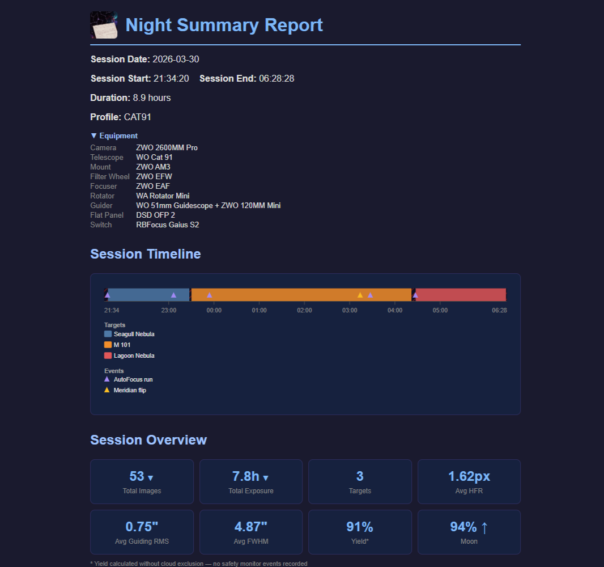

# Night Summary

A [N.I.N.A.](https://nighttime-imaging.eu/) plugin that records your astrophotography session as it runs and delivers a rich HTML report the moment your sequence completes — so you wake up to a full breakdown of the night.

<strong>Click to see full example report</strong>

 

**[Full documentation and setup guide](https://vorticose.github.io/nina.plugin.nightsummary/)**

## What's in the report

- Equipment profile showing your connected gear with customizable display names and per-field visibility
- Session event timeline showing AutoFocus runs, meridian flips, and safety monitor events
- Session overview with at-a-glance stats: total images, total exposure time, target count, average HFR, average FWHM, average guiding RMS, and imaging yield
- Yield and Imaging Overhead Analysis — a per-category timing breakdown with stacked bar chart and detailed table showing all non-imaging time spent
- Per-target imaging summaries with filter breakdown, exposure counts, total integration time, sky position angle, a DSS sky survey thumbnail with FOV overlay, and an altitude chart with optional minimum altitude line from Target Scheduler
- Live Stack thumbnails — latest stacked image per target and filter (requires Live Stack plugin)
- Per-target image quality stats: HFR, FWHM and Eccentricity (with Hocus Focus plugin), and guiding RMS with per-filter breakdowns
- Star count consistency (CV) reported separately for broadband and narrowband filters
- Target Scheduler integration — per-filter progress bars showing desired, acquired, and accepted frame counts (requires Target Scheduler plugin)
- Session history table with total integration and image quality stats for all previous sessions
- Configurable Metric Charts — multiple charts with customizable x-axis and 10+ metrics to choose from
- Tonight's Preview — a visual timeline of what Target Scheduler plans to image tonight (requires Target Scheduler API)
- Delivery via email, Discord, Pushover, or local save with NINA filename pattern variables

## Feature details

### Equipment profile
Shows all 12 NINA equipment types (camera, telescope, mount, filter wheel, focuser, rotator, guider, dome, flat panel, safety monitor, weather station, switch). Each field can be toggled on or off, and display names can be overridden for cleaner presentation.

### Yield and Imaging Overhead Analysis
Parses NINA logs to show exactly where your non-imaging time went — camera download, filter changes, dithering, autofocus, plate solves, centering, slew, and more. Displayed as a stacked bar chart and a detailed timing table with per-category breakdowns.

### Per-target imaging
Each target gets its own section with filter breakdown, exposure counts, total integration time, and sky position angle. Includes a DSS sky survey thumbnail with your camera's FOV overlay and an altitude chart showing the full rise/set arc with your imaging window highlighted. When Target Scheduler is installed, an optional minimum altitude line is shown on the altitude chart.

### Live Stack thumbnails
When the Live Stack plugin is installed and running, Night Summary captures the latest stacked image for each target and filter and embeds it in the report. Organized by broadband, narrowband, and color composite stacks.

### Image quality
HFR is provided natively by NINA. With the Hocus Focus plugin installed, FWHM and Eccentricity are added. All metrics include per-filter breakdowns and guiding RMS. Star count consistency (CV) measures how stable transparency and focus were across exposures, reported separately for broadband and narrowband.

### Session history
A per-target table showing date, total integration, and image quality stats for all previous sessions. Cumulative integration time is tracked per target across all sessions.

### Metric Charts
Add multiple charts, each plotting any two metrics with a customizable x-axis. Choose from HFR, FWHM, Eccentricity, Guiding RMS, Focuser Temperature, Ambient Temperature, Altitude, Airmass, Humidity, Focuser Position, and more.

### Tonight's Preview
A visual timeline of what Target Scheduler plans to image tonight, with per-target filter breakdowns. Requires the Target Scheduler API to be enabled.

### Delivery options
- **Email** via SMTP — Gmail is the default and easiest to set up, but any SMTP provider is supported
- **Discord** webhook — embed summary + HTML report as file attachment
- **Pushover** — instant push notification with a short text summary
- **Save locally** — supports NINA filename pattern variables in the save path for automatic organization by date, target, etc.

All channels can be enabled independently, tested without running a sequence, and previous sessions can be resent at any time. NINA shows toast notifications when reports are generated and delivered, including warnings if any section couldn't be included.

### Report detail levels
Three levels control how much is included: Snapshot (header and filter table only), Standard (adds timeline, altitude charts, and image quality), and Full (adds overhead analysis, metric charts, session history, and tonight's preview). Each section can also be toggled individually, and all sections can be expanded by default.

### Settings and preview
Settings are saved to a stable JSON file that persists across plugin updates. A built-in Report Preview lets you view reports with real session data or test data directly from the plugin options page.

## Optional integrations

**Target Scheduler** — when installed, Night Summary reads imaging targets and frame counts directly from the Target Scheduler database, adding per-filter progress bars and cumulative integration tracking. With the Target Scheduler API enabled, the report also includes Tonight's Preview showing the planned imaging schedule for tonight. Without Target Scheduler, targets and coordinates are captured from NINA's sequence data.

**Hocus Focus** — when installed, Night Summary reads FWHM and Eccentricity measurements from each saved image. Without it, only HFR (provided natively by NINA) is included.

**Live Stack** — when installed and running, Night Summary captures the latest stacked image for each target and filter and embeds it in the report. Supports broadband, narrowband, and color composite stacks.

## Requirements

- N.I.N.A. 3.2 or later

## Installation

Night Summary is available through NINA's built-in plugin manager:

1. In NINA, go to **Options → Plugins**.
2. Search for **Night Summary** and click **Install**.
3. Restart NINA when prompted.

To install manually, download `NINA.Plugin.NightSummary.zip` from the [Releases](../../releases/latest) page and extract it to `%LOCALAPPDATA%\NINA\Plugins\3.0.0\Night Summary\`.

## Initial Setup

Before your first session, open **Options → Plugins → Night Summary** and configure at least one delivery channel:

- **Email** — enter your Gmail address and an App Password (not your regular account password). If you're using another provider, select *Other provider* and enter your SMTP host, port, and credentials.
- **Discord** — paste your webhook URL.
- **Pushover** — enter your User Key and App Token.
- **Save locally** — enable this to save the HTML report automatically, no account required.

Use the **Send Test Report** button in each section to verify your settings. If using email and you don't see it arrive, check your spam folder.

## Adding the Sequence Instructions

Night Summary uses two sequence instructions that must both be present: **Night Summary Start** and **Night Summary End**.

1. In the NINA sequencer, search for **Night Summary** in the instruction list — both instructions will appear.

2. Place **Night Summary Start** near the top of your sequence, before any imaging begins, but after equipment is connected so the equipment profile can be accuratly displayed.

3. Place **Night Summary End** at the very end of your sequence, after all imaging is complete. This is what triggers the report — it must execute for the report to be delivered.

If you use **Target Scheduler**, place Night Summary Start before the Target Scheduler Container and Night Summary End after it.

Once your sequence completes, check your configured delivery channel for the report. You can also resend any previous session report at any time from the plugin options page.

## License

[Mozilla Public License 2.0](LICENSE.txt)
