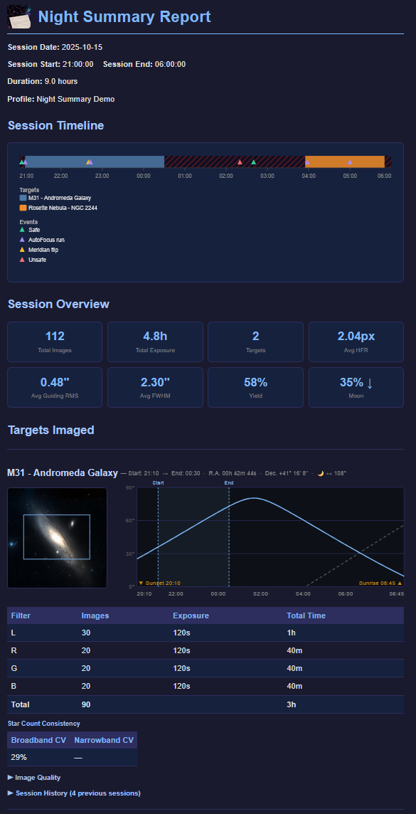

# Night Summary

A [N.I.N.A.](https://nighttime-imaging.eu/) plugin that records your astrophotography session as it runs and delivers a rich HTML report the moment your sequence completes — so you wake up to a full breakdown of the night.

---

## Features

**Session data**
- Per-target and per-filter exposure counts, total integration time, and imaging yield
- Image quality metrics: HFR, FWHM, Eccentricity, and guiding RMS — with per-filter breakdowns
- Star count consistency (CV) — measures how stable transparency and focus were across exposures, reported separately for broadband and narrowband
- Session event timeline — AutoFocus runs, meridian flips, and safety monitor events shown on an interactive SVG timeline

**Visuals**
- DSS sky survey thumbnail per target with FOV overlay (uses your sensor and focal length from the NINA profile)
- Altitude curve per target — full rise/set arc with your imaging window highlighted
- Configurable Metric Chart — plot any two metrics over time (HFR, FWHM, Eccentricity, Guiding RMS, Focuser Temp, Ambient Temp)

**History**
- Per-target session history table — date, integration, avg HFR, avg FWHM, avg guiding RMS for previous sessions
- Cumulative integration time per target across all previous sessions

**Target Scheduler integration**
- Per-filter progress bars showing desired, acquired, and accepted frame counts
- Reads grading status from the Target Scheduler database to mark accepted vs rejected frames

**Delivery options**
- Email via SMTP — Gmail is the default and easiest to set up, but any SMTP provider is supported
- Discord webhook — embed summary + HTML report as file attachment
- Pushover — instant push notification with a short text summary
- Save locally — HTML report saved to `Documents\N.I.N.A.\Night Summary\Saved Reports\`

All channels can be enabled independently, tested without running a sequence, and previous sessions can be resent at any time.

---

## Requirements

- N.I.N.A. 3.0 or later
- .NET 8 (included with NINA 3)

---

## Installation

### Via the NINA Plugin Manager (recommended)

1. Open N.I.N.A. and go to **Options → Plugins**
2. Search for **Night Summary**
3. Click **Install** and restart NINA

### Manual install

1. Download the latest `NINA.Plugin.NightSummary.zip` from the [Releases](../../releases) page
2. Extract the contents into `%LOCALAPPDATA%\NINA\Plugins\`
3. Restart NINA

---

## How to Use

1. Add the **Night Summary Start** instruction near the beginning of your sequence
2. Add the **Night Summary End** instruction at the end of your sequence
3. Configure your delivery settings in **Options → Plugins → Night Summary**

That's it. Night Summary records data automatically as your sequence runs and sends the report when it ends.

---

## Optional Integrations

**Target Scheduler** — when installed, Night Summary reads imaging targets and frame counts directly from the Target Scheduler database, adding per-filter progress bars and cumulative integration tracking. Without it, targets and coordinates are captured from NINA's sequence data.

**Hocus Focus** — when installed, Night Summary reads FWHM and Eccentricity measurements from each saved image. Without it, only HFR (provided natively by NINA) is included.

---

## Email Setup

**Gmail (recommended for simplicity)**

Gmail requires an App Password — not your regular account password. Generate one at [myaccount.google.com](https://myaccount.google.com) → Security → App Passwords.

**Other providers**

Any SMTP provider is supported. Select **Other provider** in the plugin options and enter your provider's server details. Most providers require an App Password or API key rather than your regular account password — check your provider's documentation.

---

## License

[Mozilla Public License 2.0](LICENSE.txt)
