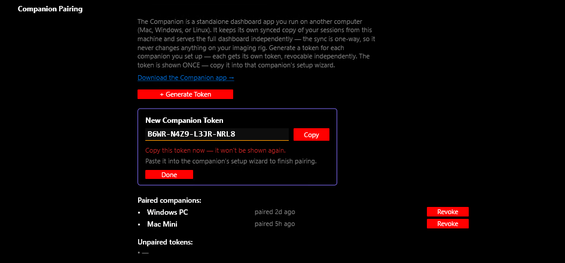
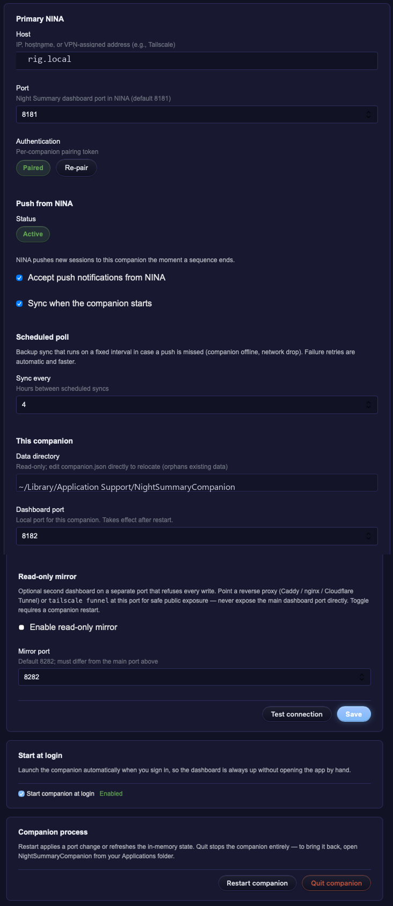

# Companion App

The Night Summary **Companion** is a standalone dashboard app you run on a **second computer** — Mac, Windows, or Linux. It keeps its own synced copy of your sessions from the machine running NINA and serves the full Night Summary dashboard independently, so you can browse your imaging history even when the NINA machine is asleep or powered off.

The sync is **one-way**: the Companion only pulls data from your NINA machine and never writes anything back to it.

---

## How it works

1. The **Local Dashboard** runs on your NINA machine (see [Live Dashboard](dashboard)).
2. You install the **Companion** on another computer and pair it with a one-time token.
3. The Companion syncs a copy of your reports, thumbnails, and database, then serves the same dashboard from its own copy — on a schedule and whenever NINA finishes a session.

{: .note }
> The Companion needs the Local Dashboard enabled on the NINA machine, plus network access to it — the same local network, or a VPN such as Tailscale for remote access.

---

## Download

Grab the latest build from the [**Releases page**](https://github.com/vorticose/nina.plugin.nightsummary/releases/latest) and follow the steps for your OS.

### Windows

1. Download `NightSummaryCompanion-win-x64.zip` and unzip it.
2. Double-click `NightSummaryCompanion.exe` — it's a single file, no install, drop it anywhere.

### macOS

1. Download `NightSummaryCompanion-mac-arm64.tar.gz` (Apple Silicon).
2. Double-click to extract, drag `NightSummaryCompanion.app` into **Applications**, then open it (first launch on a downloaded copy: right-click → **Open**).

### Linux

One line, no root:

```sh
curl -fsSL https://github.com/vorticose/nina.plugin.nightsummary/releases/latest/download/install-companion.sh | sh
```

Then launch **Night Summary Companion** from your applications menu. Other options: a `.deb` (`sudo apt install ./nightsummary-companion_*.deb`), a portable AppImage, or the tarball.

---

## Pairing

On first launch the Companion opens a setup wizard in your browser.



1. On the **NINA machine**, open **Options → Night Summary Settings → Local Dashboard → Companion Pairing** and click **+ Generate Token**. The token is shown once — copy it.
2. In the Companion wizard, enter your NINA machine's address (for example `http://astro-pc:8181`) and paste the token.
3. The Companion runs its first sync and opens the dashboard.


Each companion you set up gets its **own token**, which you can **Revoke** independently from the Companion Pairing panel. The paired list there updates as companions connect.

---

## Keeping it running

- The Companion runs as a background app and reopens its dashboard in your browser whenever you launch it.
- Turn on **Start at login** in the Companion's **Settings** tab to have it start automatically.
- Your pairing and settings survive app updates — you pair once per computer, not once per release.


