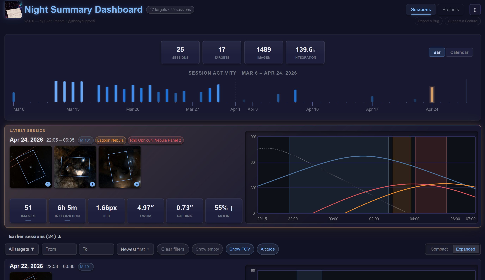

# Live Dashboard

Night Summary v3 includes a built-in web dashboard that runs on your NINA machine and is accessible from any browser on your network — a desktop, laptop, tablet, or phone.

The dashboard gives you a live view of all your recorded sessions and lifetime imaging statistics, with the ability to open any full report directly in your browser without needing Night Summary to regenerate or deliver it.

---

## Enabling the Dashboard

1. Open **Options > Night Summary Settings** and scroll to the **Local Dashboard** section
2. Check **Enable Local Dashboard**
3. Set a port (default: **8181**) — any unused port works
4. Click **Start Server**

The URL appears in the settings panel when the server is running. It looks like `http://<your-machine-name>:8181`.

{: .note }
> Night Summary starts the local dashboard server automatically when NINA launches, as long as **Enable Local Dashboard** is checked. The **Start/Stop** buttons let you restart it without restarting NINA.

### Accessing from another device on your local network

The server binds to all network interfaces, so any device on the same local network can access it. Use the machine name or local IP address shown in the settings panel — for example, `http://astro-pc:8181` from a tablet on the same Wi-Fi.

### Accessing from a remote device (VPN)

If your NINA machine is at a remote observatory or you want to check in from outside your home network, a VPN is the cleanest solution. A VPN creates a private, encrypted tunnel between your devices so your remote phone or laptop appears to be on the same local network as the imaging machine — no port forwarding, no public IP required.

Two popular options that work well for this:

- **[Tailscale](https://tailscale.com/)** — installs as a lightweight app on each device and assigns each one a stable private IP on your tailnet. Night Summary detects when Tailscale is running and shows a Tailnet URL directly in the settings panel next to the local URL.
- **[ZeroTier](https://www.zerotier.com/)** — similar concept, creating a virtual private network across your devices. Once both machines are joined to the same ZeroTier network, the dashboard URL is reachable using the ZeroTier-assigned IP address.

Both services have free tiers that are more than sufficient for personal use. See their respective documentation for setup instructions.

---

## Generating Reports

The dashboard displays data from **saved HTML reports**. Before browsing session history, make sure reports exist for your past sessions:

1. In Settings > Local Dashboard, click **Generate All Reports**
2. Night Summary generates HTML for every session that doesn't already have a report file — this may take a minute for large histories

After this one-time step, new sessions generate reports automatically at the end of each sequence (as long as **Save Report Locally** is enabled in Saved Reports settings).

{: .important }
> If **Save Report Locally** is off, the dashboard can show session cards with stats but won't be able to display the full report view for that session.

---

## Sessions Tab

The Sessions tab is the main view. The layout is:

1. **Lifetime stats strip** — cumulative totals across all sessions
2. **Latest session card** — always shown at the top, full expanded view
3. **Earlier Sessions** — a collapsible section containing the filter bar and the rest of your session history

### Session Cards

Each card shows:

- **Date and time** — session start/end times
- **Target badges** — color-coded pill for each target imaged, matching the altitude chart lines
- **Thumbnails** — sky survey thumbnails per target with optional FOV overlay
- **Stat boxes** — FRAMES, INTEGRATION, HFR, GUIDING, MOON at a glance
- **Altitude chart** — multi-target composite chart with animated curve drawing

**Hover interactions:**

| Action | Result |
|--------|--------|
| Hover stat box | Per-filter or target breakdown popup |
| Hover thumbnail | Expanded image and target name label |
| Dwell on thumbnail (with Live Stack data) | Live Stack image shelf — all captured stacks for that target |
| Hover altitude chart | Crosshair with time readout and altitude tooltip for the active target |

**Clicking a card** opens the full HTML report embedded in the dashboard.

### Compact vs. Expanded View

A toggle in the filter bar switches the earlier sessions list between two layouts:

| Mode | What's shown |
|------|-------------|
| **Expanded** | Thumbnails, stat boxes, altitude chart — full card |
| **Compact** | Inline summary line (frames · integration · HFR · guiding), no thumbnails or chart |

Compact mode is useful for scanning a long session list quickly. Your preference is saved per browser.

On narrow screens (below 720px), the layout adjusts responsively — spacing tightens and some header elements stack vertically — but the expanded/compact toggle still controls whether thumbnails and charts are shown.

### Viewing a Full Report

Click anywhere on a session card to open the embedded report view. The full HTML report renders inside the dashboard with a navigation bar at the top. Use the **← Sessions** back link to return to the card list.

### Hiding Sessions

Each card has a subtle **×** button in the top-right corner (visible on hover). Click it to hide a session from the list without deleting any data. Hidden sessions can be revealed using the **Show hidden (N)** toggle in the filter bar.

---

## Filter Bar

The filter bar sits below the latest session card, inside the **Earlier Sessions** collapsible section. It controls which earlier sessions are shown — the latest session card at the top is always visible regardless of filters. All filters apply immediately without a page reload.

| Control | What it does |
|---------|-------------|
| **Target picker** | Searchable 2-column popover — check/uncheck targets to show only those sessions |
| **Date from / Date to** | Date range filter — click the field to open the native date picker |
| **Show empty** | When off (default), hides sessions with zero images |
| **Show FOV** | Toggles the FOV overlay rectangle on all thumbnails |
| **Compact / Expanded** | Switches the card layout (see above) |
| **Sort order** | Several sort options for the session list |
| **Show hidden (N)** | Reveals hidden sessions (only shown when hidden sessions exist) |
| **Clear filters** | Resets all filters and unhides hidden sessions |

---

## Stats Tab

The Stats tab shows lifetime statistics aggregated across all sessions.

### Targets / Projects Sub-Tab

Each target you've ever imaged gets a card showing:

- Total integration time and image count across all sessions
- Sky thumbnail
- Target status (from its project, if assigned)
- A compact per-session history chart

**Controls:**

| Control | What it does |
|---------|-------------|
| Sort pills | Sort by: Integration, Images, Last imaged, Name |
| Group toggle | Group targets by project |
| Status filter chips | Filter by project status (Active, Inactive, etc.) |

Click a target card to open a detail panel with the full session-by-session breakdown, per-filter stats, and the altitude chart history.

Use the **Manage Projects** button to create custom projects and assign targets to them. Projects support grouping, status tracking, and integration time goals. If Target Scheduler is installed, TS projects are imported automatically — but projects work independently of TS and don't require it.

### Tonight Sub-Tab

Shows what Target Scheduler plans to image tonight — same as Tonight's Preview in reports, but always up-to-date without waiting for a new report.

Requires Target Scheduler to be installed with the **API enabled**. See [Target Scheduler Integration]() for setup instructions.

{: .note }
> The Tonight sub-tab is hidden entirely when Target Scheduler is not installed or its API is not enabled.

---

## Light and Dark Mode

A toggle button in the top-right header switches between dark mode (default) and light mode. The preference is saved per browser.

---

## Tips

- **Bookmark the URL** — once the server is running, the dashboard URL stays the same between sessions
- **Phone / tablet** — the dashboard is mobile-optimized; use the Tailnet URL if your imaging machine is remote
- **After a long break** — if you've been away from imaging, use **Generate All Reports** to catch up on any sessions that don't have reports yet
