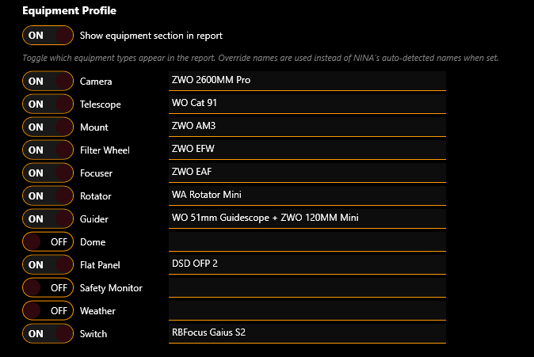
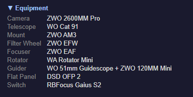

# Equipment Profile

The equipment profile is a collapsible section in the report header that lists all your connected equipment. It helps you (and anyone you share reports with) quickly see what gear was used for the session.

## How Auto-Detection Works

When a session starts, Night Summary reads the current equipment names from NINA's mediators — the same names you see in NINA's equipment panels. It captures names again at session end to pick up any equipment that was connected after the session started.

{: .note }
> For best results, place the **Night Summary Start** instruction in your sequence after all equipment is connected (after cool camera, connect guider, etc.). This ensures the equipment profile captures all your gear on the first pass rather than waiting until session end.

Auto-detected names come directly from the equipment drivers. For example, your camera might report as "ZWO ASI2600MM Pro" and your mount as "iOptron CEM70G".

## Overriding Names

If you want friendlier names (or your driver reports something unhelpful), you can set **override names** for any equipment type. The override replaces the auto-detected name in the report.

For example:
- Camera auto-detects as "ZWO ASI2600MM Pro" — override to "ASI2600MM"
- Telescope auto-detects as "(No Name)" — override to "Esprit 100ED"

To set an override, type a name in the text box next to the equipment type in the Equipment Profile section of settings. Leave it blank to use the auto-detected name.

## Per-Field Toggles

Each of the 12 equipment types has an independent toggle to show or hide it in the report. This lets you include only the equipment that's relevant.

**Shown by default:** Camera, Telescope, Mount, Filter Wheel, Focuser, Rotator, Guider

**Hidden by default:** Dome, Flat Panel, Safety Monitor, Weather, Switch

Toggle any field on or off with the checkbox next to its name.

## Master Toggle

The **Show equipment section in report** checkbox is a master switch. When off, the entire equipment section is hidden from the report regardless of individual field toggles.

## Equipment Types

| Type | What It Shows |
|------|--------------|
| **Camera** | Imaging camera name (e.g., "ZWO ASI2600MM Pro") |
| **Telescope** | Optical tube assembly name |
| **Mount** | Equatorial or alt-az mount name |
| **Filter Wheel** | Filter wheel model |
| **Focuser** | Electronic focuser name |
| **Rotator** | Camera rotator name |
| **Guider** | Guide camera or guiding software name |
| **Dome** | Observatory dome or roll-off roof controller |
| **Flat Panel** | Flat panel or light box |
| **Safety Monitor** | Cloud/rain/wind safety device |
| **Weather** | Weather station or environmental sensor |
| **Switch** | USB switch hub or power distribution device |

## Report Appearance

In the report, the equipment section appears as a collapsible block labeled **Equipment** just below the session header. Click to expand and see a two-column grid of equipment labels and values.

Equipment that is not connected (and has no override set) is automatically excluded — you won't see empty rows.

