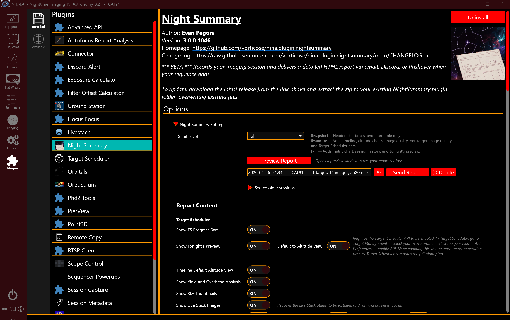
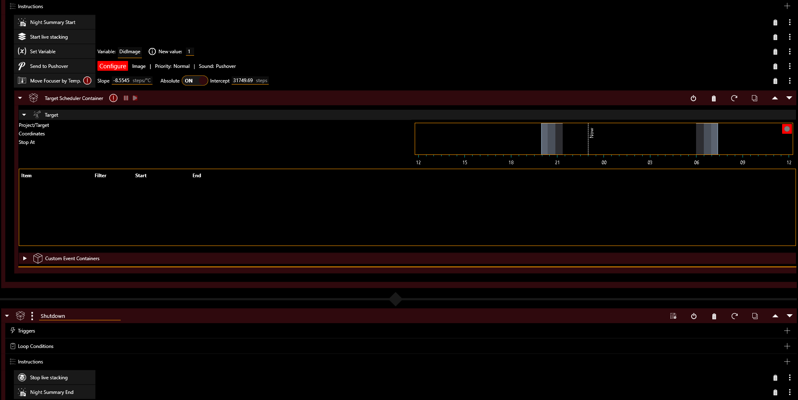
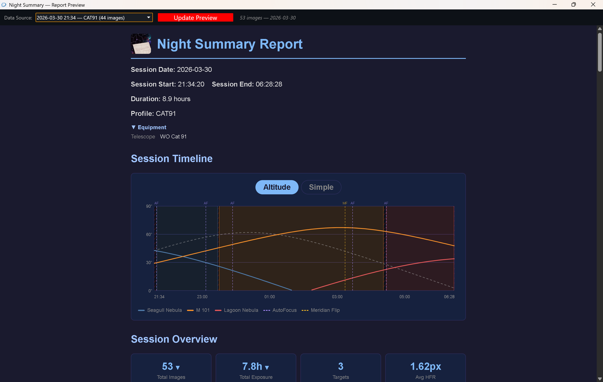

# Getting Started

This guide walks you through installing Night Summary, configuring basic settings, and generating your first report.

## Install the Plugin

1. Open NINA and click the **Plugins** icon in the left sidebar (the puzzle piece)
2. In the **Available** tab, search for **Night Summary**
3. Click **Install** and restart NINA when prompted

Night Summary can also be downloaded dirctly from the GitHub repo.  

<https://github.com/vorticose/nina.plugin.nightsummary/releases>

Night Summary requires **NINA 3.2 or later**.

After installation, Night Summary appears under **Options > Night Summary Settings** in the NINA sidebar.

## How It Works

Night Summary uses two sequence instructions to mark the start and end of your session:

1. **Night Summary Start** — place this near the top of your sequence, after equipment connection steps (cool camera, connect guider, etc.) but before any imaging begins. This ensures the [equipment profile]() captures all your connected gear.
2. **Night Summary End** — place this at the very end of your sequence, after all imaging and any park/warm-up steps

Note: If you use loops for imaging, place the Night Summary instructions outside of the loop condition in order to ensure they only run once, otherwise the session may not be recorded properly or multiple reports may be generated.

Once the sequence runs:

1. **Session starts** when the Night Summary Start instruction executes
2. **Data is recorded** for every exposure — HFR, guiding RMS, star count, filter, temperature, and more
3. **Session ends** when the Night Summary End instruction executes
4. **Report is generated** and delivered through your enabled channels

If you use **Target Scheduler**, place Night Summary Start before the Target Scheduler Container and Night Summary End after it.

{: .important }
> NOTE: If you stop the sequence manually before Night Summary End executes, no report is sent and some session data (overhead timing, live stack images, Target Scheduler grading) won't be finalized. The basic exposure data is still saved — you can generate a partial report later using **Resend Previous Session** in the plugin settings.

## Basic Configuration

Open **Options > Night Summary Settings** to configure the plugin.

### Choose a Detail Level

The **Detail Level** dropdown controls how much information your report includes:

- **Snapshot** — just the essentials: header, stat boxes, and filter table. Good for a quick glance.
- **Standard** — adds event timeline, altitude charts, image quality tables, and Target Scheduler progress bars. The best balance for most users.
- **Full** — everything in Standard plus overhead breakdown, customizable metric charts, session history, and tonight's preview. For users who want maximum detail.

### Set Up a Delivery Channel

Night Summary can deliver reports through four channels. You need at least one enabled to receive reports. See [Delivery Channels]() for detailed setup instructions.

- **Email** — full HTML report sent to your inbox
- **Discord** — summary with stats and HTML report attachement posted to a Discord channel via webhook
- **Pushover** — push notification to your phone with key session stats
- **Local Save** — HTML file saved to a folder on your computer

### Preview Your Report

Before waiting for a real imaging session, you can preview how your report will look:

1. Click **Preview Report** at the bottom of the Report Content section
2. A preview window opens showing a report generated from your most recent session data (or test data if no sessions exist)

This lets you tweak settings like detail level, chart metrics, and toggles to get the report looking the way you want.

## Your First Real Report

1. Make sure **Night Summary Start** and **Night Summary End** are in your sequence (see [How It Works](#how-it-works) above)
2. Check your configured delivery channel (email, Discord, etc.) for the report
3. Run the sequence as you normally would
4. When the sequence completes, Night Summary automatically generates and delivers your report

If something doesn't look right, check the [FAQ]() for common issues, or adjust settings and use **Preview Report** to iterate.

## Resending a Previous Report

If you need to resend a report (for example, after changing delivery settings):

1. Go to **Options > Night Summary Settings** and scroll to **Resend Previous Session**
2. Select a session from the dropdown (shows the 30 most recent by default)
3. Click **Send Report** to deliver it through all currently enabled channels

Use the **Search older sessions** expander to find sessions by date range.

## Next Steps

- [Report Sections]() — understand what each part of the report shows
- [Live Dashboard]() — enable the browser-based dashboard to browse sessions and stats from any device
- [Settings Reference]() — full list of every setting and what it does
- [Delivery Channels]() — detailed setup for email, Discord, Pushover, and local save
