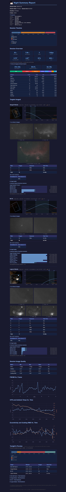

<h1>Night Summary</h1>

**Night Summary** is a plugin for [N.I.N.A.](https://nighttime-imaging.eu/) that automatically records your imaging sessions and generates detailed HTML reports when your sequence ends.

Whether you run a remote observatory or image from your backyard, Night Summary gives you a comprehensive look at what happened overnight — saved locally or delivered to your email, Discord, or Pushover.

  

## Key Features

- **Session recording** — captures every exposure with full metadata (HFR, guiding RMS, star count, filter, temperature, and more), plus autofocus runs, meridian flips, and safety monitor events
- **Rich HTML reports** — event timelines, yield/overhead breakdowns, altitude charts, sky thumbnails, image quality tables, metric charts and more
- **Multiple delivery channels** — email, Discord webhook, Pushover notifications, or local file save
- **Live Stack integration** — includes live-stacked thumbnails from the Live Stack plugin (if installed and enabled) in your report
- **Target Scheduler integration** — shows acquisition progress bars, minimum altitude lines, and a preview of tonight's imaging plan when Target Scheduler is installed
- **Metric charts** — plot any combination of HFR, FWHM, guiding RMS, temperature, humidity, and 15+ other metrics
- **Yield and imaging overhead analysis** — parses NINA logs to show exactly where your non-imaging time went (downloads, filter changes, autofocus, dithering, etc.)
- **Equipment profile** — collapsible section showing all connected equipment with customizable display names
- **Session history** — cumulative integration time per target across all sessions
- **Customizable detail levels** — Snapshot, Standard, or Full reports to match your preference
- **Light and dark mode** — reports render in your choice of color scheme
- **File naming patterns** — use NINA-style `$$PATTERN$$` variables in report filenames

## Installation

1. Open NINA and go to **Plugins** (the puzzle piece icon in the sidebar)
2. Search for **Night Summary**
3. Click **Install**
4. Restart NINA when prompted

Can also be downloaded directly from the GitHub repo.  

<https://github.com/vorticose/nina.plugin.nightsummary/releases>

Night Summary requires **NINA 3.2 or later**.

## Quick Start

Add the **Night Summary Start** and **Night Summary End** instructions to your sequence, and Night Summary records your session and generates a report automatically when the sequence ends. To actually *receive* the report, set up at least one [delivery channel]().

[See Getting Started]() for a walkthrough.

## Report Detail Levels

Night Summary offers three detail levels that control how much information appears in your report:

| Level | What's Included |
|-------|----------------|
| **Snapshot** | Header, stat boxes, filter table |
| **Standard** | + Event timeline, altitude charts, image quality, per-target IQ, Target Scheduler bars |
| **Full** | + Yield and overhead analysis, metric charts, session history, tonight's preview |

## Version

This documentation covers **Night Summary v2.10.0+** for NINA 3.2+.
