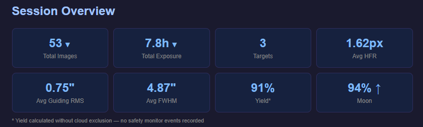
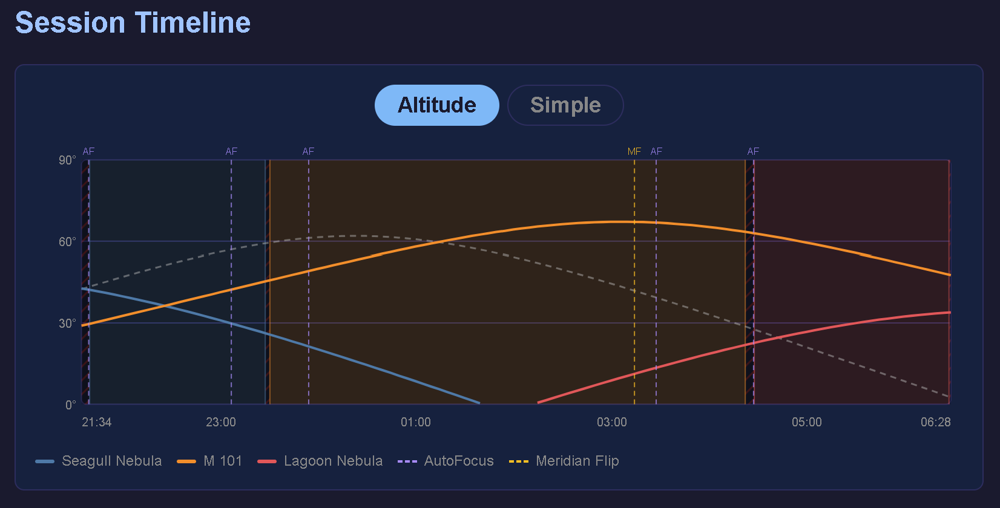
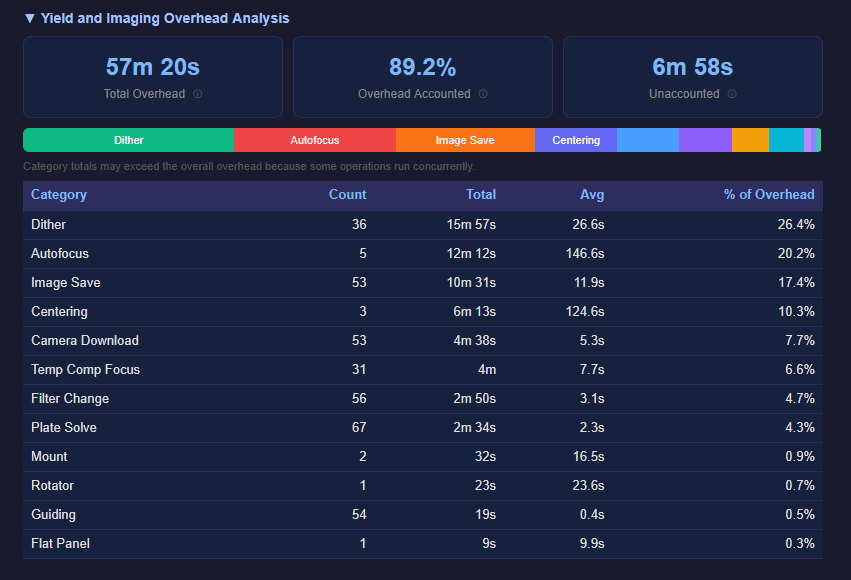
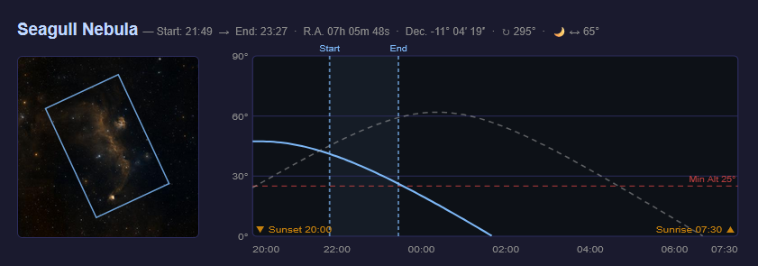
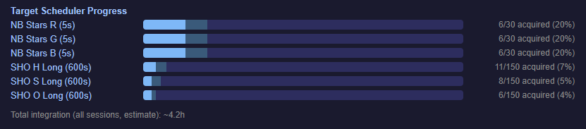
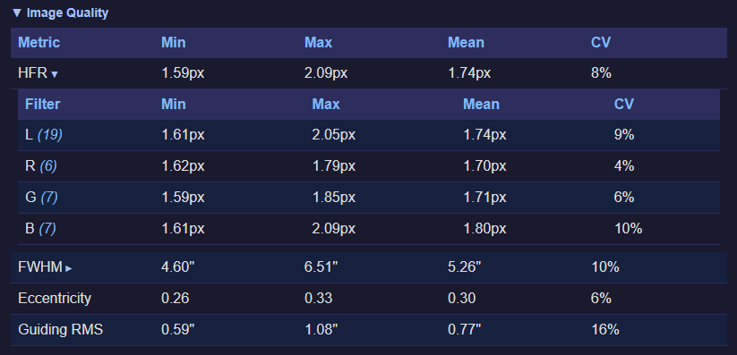
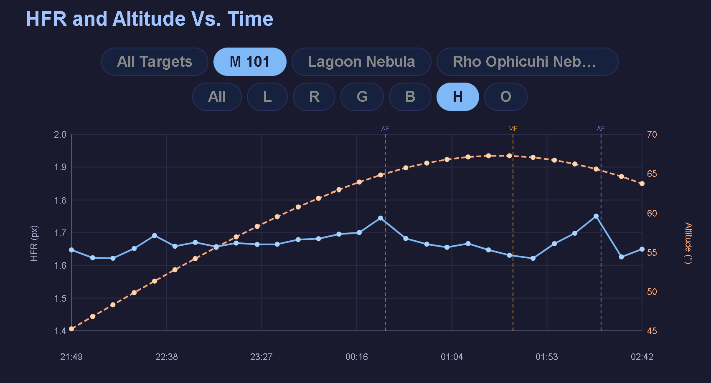
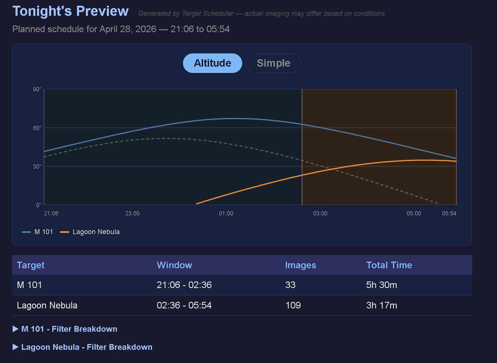

# Report Sections

Night Summary reports are built from several sections, each providing different information about your imaging session. This page explains what each section shows and which detail level is required.

## Header

**Always shown.**

The report header includes:

- **Session date and times** — start time, end time (or "In Progress" if the session is still running), and total duration in hours
- **Profile name** — the active NINA equipment profile
- **Equipment profile** — a collapsible section listing all connected equipment (camera, telescope, mount, etc.). See [Equipment Profile]() for details.

## Session Overview (Stat Boxes)

**Always shown.** Additional stats appear at higher detail levels.

A row of summary stat boxes showing key metrics at a glance:

| Stat | Detail Level | Description |
|------|-------------|-------------|
| Total Images | All | Number of captured exposures, with per-filter breakdown on click. Shows aborted count if any. |
| Total Exposure | All | Cumulative exposure time, with per-filter breakdown on click |
| Targets | All | Number of distinct targets imaged |
| Avg HFR | Standard+ | Average half-flux radius across all images (pixels) |
| Avg Guiding RMS | Standard+ | Average guiding RMS total across all images (arcsec) |
| Avg FWHM | Full | Average full-width at half-maximum (arcsec). Requires the Hocus Focus plugin. |
| Yield | Full | Percentage of imaging window spent actually exposing. If a safety monitor is connected, roof-closed time is excluded. |
| Moon | Full | Moon illumination percentage with waxing/waning arrow |

The Total Images and Total Exposure boxes are expandable — click to see the per-filter breakdown.

## Event Timeline

**Standard and Full detail levels.**

The event timeline shows your entire session at a glance across wall-clock time. Two views are available, toggled by the **Altitude / Simple** chips in the report:

### Altitude View (default)

A multi-target altitude chart spanning your session window (session start to session end). Each target gets its own color-coded curve showing its arc across the sky, with semi-transparent shading over the periods when you were actually imaging it. Includes:

- **Event markers** — vertical dashed lines for AutoFocus (AF), Meridian Flip (MF), and safety monitor transitions (S / US), each with a hover tooltip showing the event description and timestamp
- **Moon curve** — moon altitude as a dashed line (toggle in settings)
- **Grid lines** — horizontal references at 30° and 60° altitude

This view is only available when observer coordinates are set in your NINA profile. If coordinates are missing, the report falls back to Simple view with no toggle shown.

### Simple View

A flat horizontal bar divided into color-coded bands — one color per target — with diagonal hatching for idle periods between imaging runs. Useful when you want a compact, at-a-glance picture of what you imaged and when, without the altitude context.

### Settings

| Setting | Default | Description |
|---------|---------|-------------|
| Show Altitude Chart | On | Whether to compute and offer the Altitude view |
| Default to Altitude View | On | Which view opens first when you load the report |
| Show Moon Curve | On | Moon altitude line in Altitude view |

## Yield and Imaging Overhead Analysis

**Full detail level only.** See [Yield and Overhead Analysis]() for a deep dive.

Parses your NINA log file to show exactly where non-imaging time was spent. Includes:

- **Summary stat boxes** — total overhead time, percentage of overhead accounted for, and unaccounted time
- **Stacked bar chart** — color-coded horizontal bar showing the relative proportion of each overhead category
- **Detailed table** — each category with event count, total time, and average time per event

Categories include camera download, filter changes, dithering, autofocus, plate solves, centering, image saves, temperature compensation focus, meridian flips, and more.

## Target Details

**Always shown.** Content varies by detail level and available data.

For each target imaged during the session:

### Target Header
- Target name 
- Coordinates (RA/Dec)
- FOV sky rotation angle
- Session time window (first to last image)
- Moon separation angle

### Sky Thumbnail
A sky survey image showing where the target is located, with an FOV (field of view) rectangle overlay showing your camera's framing and rotation. The thumbnail is fetched from the CDS HiPS2FITS color survey. If CDS is unavailable, Night Summary falls back to NASA SkyView DSS2 Red (monochrome). If both services are down, a remote CDS URL is embedded so the browser can fetch it directly when you view the report. Controlled by the **Show Sky Thumbnails** setting.

### Altitude Chart (Standard+)
An SVG altitude plot showing the target's arc across the full night window (sunset to sunrise), with markers at each exposure. Optionally includes:
- **Moon curve** — moon altitude shown as a dashed line
- **Minimum altitude line** — dotted red line at the Target Scheduler project's minimum altitude (requires Target Scheduler)

### Live Stack Images
Thumbnails captured from the Live Stack plugin during the session. See [Live Stack Integration]().

### Filter Table
A table showing per-filter statistics: filter name, image count, individual exposure time, total time, and a **Rejected** count if any frames were discarded during the session. Rejected frames include those failed by Target Scheduler's grading criteria or manually thumbed down in the Image History interface. Hover over the rejected count to see a breakdown by rejection reason.

### Target Scheduler Progress Bars (Standard+)
Per-filter acquisition progress when Target Scheduler is installed. Shows accepted vs. acquired frames against the plan's desired total. See [Target Scheduler Integration]().

### Per-Target Image Quality (Standard+)
Expandable table showing HFR, FWHM, Eccentricity, and Guiding RMS with min/max/mean/CV for the target. Click to expand individual rows for per-filter breakdowns.

### Session History (Full)
Cumulative integration time for the target across all recorded sessions — not just tonight.

## Image Quality Section

**Standard and Full detail levels.**

A session-wide image quality summary with:

- **Star Count CV** — coefficient of variation of star counts across the session, with a per-filter breakdown table. Useful for detecting cloud passages or other consistency issues. You can configure [filter classifications](#filter-classifications) to group broadband and narrowband separately.
- **Metric Chart** (Full) — customizable chart showing your chosen metrics across the session. In multi-target or multi-filter sessions, two rows of chips appear above the chart for narrowing the data:

| Chip row | Appears when | What it does |
|----------|-------------|--------------|
| **Target chips** — All Targets · M51 · NGC 7000 · … | 2+ distinct targets in session | Filters chart data to that target only |
| **Filter chips** — All · Ha · OIII · … | 2+ distinct filters in session | Filters chart data to that filter only |

Both selectors are independent and additive — selecting Target=M51 and Filter=Ha shows only the M51/Ha data points, with the Y-axis rescaling automatically to fit. Both default to "All". Both rows can be disabled individually in settings. See [Metric Charts]() for the full list of available metrics.

## Tonight's Preview

**Full detail level only.** Requires Target Scheduler with its API enabled.

Shows what Target Scheduler plans to image tonight — target names, planned exposure times, and filter sequences. Useful for reviewing the upcoming session. See [Target Scheduler Integration]().

## Footer

**Always shown.**

Shows the plugin version, NINA version, and author credit.
