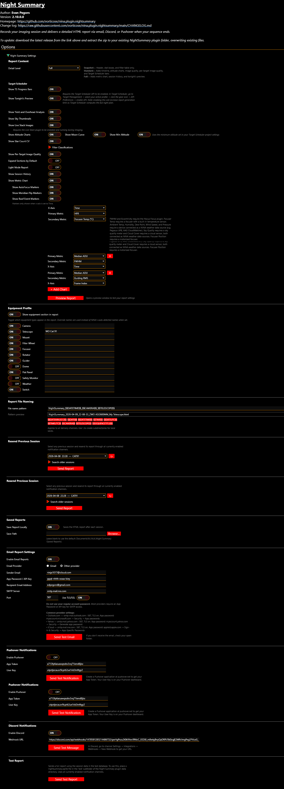

# Settings Reference

All Night Summary settings are found under **Options > Night Summary Settings** in NINA. Settings persist to a JSON file in the plugin data directory, so they survive NINA updates and plugin reinstalls.

  

---

## Report Content

### Detail Level

Controls how much information appears in the report.

| Value | Description | Default |
|-------|------------|---------|
| **Snapshot** | Header, stat boxes, and filter table only | |
| **Standard** | Adds timeline, altitude charts, image quality, per-target IQ, and TS progress bars | |
| **Full** | Adds yield and overhead analysis, metric charts, session history, and tonight's preview | Yes |

### Target Scheduler Options

These options are only available when Target Scheduler is installed.

| Setting | Default | Detail Level | Description |
|---------|---------|-------------|-------------|
| Show TS Progress Bars | On | Standard+ | Per-filter acquisition progress bars showing accepted vs. acquired frames |
| Show Tonight's Preview | On | Full | What Target Scheduler plans to image tonight. Requires the TS API to be enabled. |

{: .note }
> To enable the Target Scheduler API: in Target Scheduler, go to **Target Management > select your active profile > gear icon > API Preferences > enable API**. This will increase report generation time as Target Scheduler computes the full night plan.

### Report Display Toggles

| Setting | Default | Detail Level | Description |
|---------|---------|-------------|-------------|
| Show Yield and Overhead Analysis | On | Full | Yield and imaging overhead breakdown parsed from NINA logs |
| Show Sky Thumbnails | On | All | CDS HiPS2FITS sky survey images with FOV overlay for each target |
| Show Live Stack Images | On | All | Live-stacked thumbnails from the Live Stack plugin |
| Show Altitude Charts | On | Standard+ | Per-target altitude plots with exposure markers |
| Show Moon Curve | On | Standard+ | Moon altitude line on altitude charts (requires altitude charts on) |
| Show Min Altitude | On | Standard+ | Target Scheduler minimum altitude line on altitude charts (requires TS) |
| Show Star Count CV | On | Standard+ | Star count coefficient of variation with per-filter breakdown |
| Show Per-Target Image Quality | On | Standard+ | Expandable per-filter HFR, FWHM, guiding, etc. for each target |
| Expand Sections by Default | Off | All | Open all collapsible report sections by default |
| Light Mode Report | Off | All | Use light color scheme instead of dark |
| Show Session History | On | Full | Cumulative integration time per target across all sessions |
| Show Metric Chart | On | Full | Customizable chart of session metrics |

### Filter Classifications
{: #filter-classifications }

Controls how filters are classified for Star Count CV grouping. Filters are read from your NINA profile.

| Classification | Description |
|---------------|-------------|
| **Auto** | Uses first-letter matching: L, R, G, B = broadband; H, S, O = narrowband |
| **Broadband** | Force-classify as broadband |
| **Narrowband** | Force-classify as narrowband |
| **Exclude** | Exclude from Star Count CV calculations |

Click the refresh button to reload filters from your current NINA profile.

### Metric Chart Settings

Available at **Full** detail level when the metric chart is enabled. See [Metric Charts]() for details.

| Setting | Default | Description |
|---------|---------|-------------|
| X-Axis | Time | What the horizontal axis represents |
| Primary Metric | HFR | The main metric plotted |
| Secondary Metric | None | Optional second metric on a separate Y-axis |
| Additional Charts | (none) | Add up to 4 extra charts with independent metric selections |
| Show AutoFocus Markers | On | Overlay purple AF markers on the chart at each AutoFocus run (Time x-axis only) |
| Show Meridian Flip Markers | On | Overlay amber MF markers at meridian flip events (Time x-axis only) |
| Show Roof Markers | Off | Overlay green/red S/US markers at safety monitor state changes (Time x-axis only) |

---

## Equipment Profile

Controls the collapsible equipment section in the report header. See [Equipment Profile]().

| Setting | Default | Description |
|---------|---------|-------------|
| Show equipment section | On | Master toggle for the entire equipment section |
| Per-field toggles | Camera, Telescope, Mount, Filter Wheel, Focuser, Rotator, Guider on; others off | Show/hide individual equipment types |
| Override names | (blank) | Custom display name used instead of NINA's auto-detected name |

Equipment types: Camera, Telescope, Mount, Filter Wheel, Focuser, Rotator, Guider, Dome, Flat Panel, Safety Monitor, Weather, Switch.

---

## Report File Naming

| Setting | Default | Description |
|---------|---------|-------------|
| File name pattern | `NightSummary_$$DATEMINUS12$$` | Pattern for report filenames, using NINA-style variables |
| Pattern preview | (read-only) | Shows what the current pattern resolves to |

See [File Naming Patterns]() for available variables.

---

## Resend Previous Session

Not a persistent setting — a utility for resending reports from past sessions through all currently enabled channels. Includes date-range search for finding older sessions.

---

## Saved Reports

| Setting | Default | Description |
|---------|---------|-------------|
| Save Report Locally | On | Save HTML report to disk after each session |
| Save Path | (blank) | Custom save directory. Default: `Documents\N.I.N.A.\Night Summary\Saved Reports\` |

---

## Email Report Settings

| Setting | Default | Description |
|---------|---------|-------------|
| Enable Email Reports | Off | Master toggle for email delivery |
| Email Provider | Gmail | Gmail (simplified setup) or Other (custom SMTP) |

### Gmail Settings

| Setting | Description |
|---------|-------------|
| Gmail Address | Your Gmail email address |
| App Password | 16-character Gmail App Password (not your regular password) |
| Recipient Email Address | Where to send the report |

### Custom SMTP Settings

| Setting | Default | Description |
|---------|---------|-------------|
| Sender Email | | Your email address |
| App Password / API Key | | Provider-specific app password |
| Recipient Email Address | | Where to send the report |
| SMTP Server | smtp.gmail.com | Your provider's SMTP hostname |
| Port | 587 | SMTP port number |
| Use TLS/SSL | On | Enable TLS encryption |

---

## Pushover Notifications

| Setting | Default | Description |
|---------|---------|-------------|
| Enable Pushover | Off | Master toggle for Pushover delivery |
| App Token | | From your Pushover application settings |
| User Key | | From your Pushover dashboard |

---

## Discord Notifications

| Setting | Default | Description |
|---------|---------|-------------|
| Enable Discord | Off | Master toggle for Discord delivery |
| Webhook URL | | Discord channel webhook URL |

---

## Test Report

Generates and sends a full report through all currently enabled channels using a test database. Night Summary ships with built-in test data so this works out of the box. If you want to test with your own data, replace the `nightsummary.sqlite` file in the `test` subfolder of the Night Summary plugin data directory.
